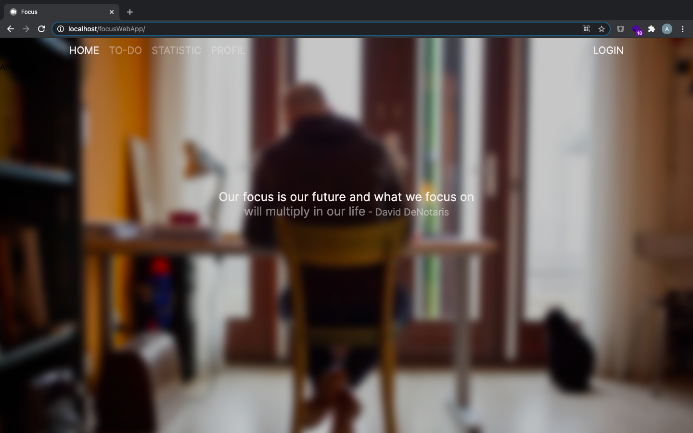

# Focus Web App
Bei diesem Projekt handelt es sich um eine *To-Do-List* application. Der User soll einen besseren Überblick über seine anstehenden Tätigkeiten bekommen indem er diese in Form einer Tasgesüberischt oder Wochenübersicht niederschreiben und abharken kann. Außerdem gibt es einen Statistik bereich indem der User sich streaks aufbauen kann, motivierende Zitat freischalten kann und einen überblick über seine erldeigten aufgaben hat. So vergilft diese App zu eine **FOKUS**sierterem und produktiverem leben.  

## Motivation
Dieses Projekt wurde im Rahmen meiner Abschlussprüfung erstellt. Es soll eine Alternative zu den überladenen und unübersichtlichen *To-Do-List* Applications bieten die es auf dem Markt gibt.

## Status 
Die App befindet sich noch in der bearbeitung und es werden weitere Versionen folgen.

## Code style
Die App ist in Prozeduralen Javascript geschrieben. Der PHP Code ist Objekt-Orientiernd in Form eines MVC Models geschrieben. Die Application ist Asynchron programmiert 

## Tech/Framework 
- Jquery
- Chart.js
- Fontawesome

## Installation
...

## Code Example
Anhand diese beispiel wird deutlich wie das MVC Model in Zusammenhang mit dem Asynchronen Javascript funktioniert. In diesem Beispiel geht es darum eine Aufgabe der *To-Do-List* hinzuzufügen. Die Javascript Funktion wird über das PhP View file in der HTML Code steht ausgelöst. Anschließend werden die daten per JSON über den *Ajax-Call* an die PHP Funktion im Controller File weitergegeben, diese verabeitet die Daten und lößt die PHP Funktion im Model File aus. Diese Funktion gibt die Daten an die Datenbank weiter und gibt diese dann wieder an den Controller zurück, der die Daten per JSON wieder zurück an die JavaScript Funktion gibt, welche in diesem Fall nach einer Erfolg der Durchführung eine weitere Funktion anspricht, welche Die List neu lädt. Somit sieht der User sofort die neu hinzugefügte Aufgabe und gleichzeitig wurde dies in der Datenbank hinzugefügt.

### JavaScript Funktion

```JavaScript
let newTaskBtn = $('.new-task-btn');

newTaskBtn.on('click', addNewTask);

function addNewTask(e) {
    // Init data
    let newTask = newTaskInput.val();
    let userId = newTaskBtn[0].dataset.userid;
    let activeLi = $('.active-list');
    let activeLiId = activeLi[0].dataset.listid;
    let date = $('.date-button').text();


    $.ajax({
        url: '/focusWebApp/Applications/addNewTask',
		type: 'post',
		async: true,
		data: {
            "newTask": newTask,
            "userId": userId,
            "activeLiId": activeLiId,
            "date": date
		},
		statusCode: {
			200: function(feedback){
                //Clear Input
                newTaskInput.val('');
                //call loadTasks function
                loadTasks(activeLiId);
			},
			422: function(feedback){

			}
		},
    });

    // Prevent the default behavior of refreshing the page
    e.preventDefault();
} 
```

### PHP Controller Funktion

```php 
public function addNewTask() {
    //Check if Ajax Call
    if (isAjaxCall()) {
        //Init data 
        $errorsArray = array();

        $data = [
            'newTask' => trim(htmlspecialchars($_POST['newTask'])),
            'userId' => trim(htmlspecialchars($_POST['userId'])),
            'activeLiId' => trim(htmlspecialchars($_POST['activeLiId'])),
            'date' => trim(htmlspecialchars($_POST['date']))
        ];

        // Validate data

        //Check for errors
        if (count($errorsArray) === 0) {
            
            // Call model function
            if($this->applicationModel->addNewTask($data)) {
                //success
                http_response_code(200);
            } else {
                //PDO statement failed
                http_response_code(422);
            }
        } else {
            //Data validation failed
            $this->json($errorsArray, 422);
        }
    } else {
        // Load View
        $data = [
            'title' => 'To-Do-List',
        ];

        $this->view('applications/to_do', $data);
    }
}
```

### PHP Model Funtkion

```php
    public function addNewTask($data){
        //PDO statement
        $this->db->query('INSERT INTO tasks (taskname, userid, listid, date) VALUES (:taskname, :userid, :listid, :date)');

        //Bind Values
        $this->db->bind(':taskname', $data['newTask']);
        $this->db->bind(':userid', $data['userId']);
        $this->db->bind(':listid', $data['activeLiId']);
        $this->db->bind(':date', $data['date']);

        // Execute
        if($this->db->execute()) {
            return true;
        } else {
            return false;
        };
    }
```

## API referenz
- [QuoteApi](https://type.fit/api/quotes)

## Benutzung
Nach der Installation muss sich der Nutzer registirern um die Funktionen der App nutzen zu können.  
Anschließend kann der nutzer auf der Unterseite TO-DO neue *To-Do-Listen* erstellen und diesen Aufgaben anhand von ausgewählter Daten hinzufügen.  
Des weiteren besteht die Möglichkeit sich die anstehenden Aufgaben der ausgewählten Woche anzeigen zu lassen. Auch hier können Aufgaben erledigt oder neu hinzugefügt werden.  

Auf der Unterseite statistic kann sich der Benutzer seine Statistiken ansehen. Dort findet er zum Beispiel die Anzahl der erledigten Aufgaben dieser Woche. Seinen derzeitigen Streak* und sein letztes gesammeltes motivations-Zitat*. Durch einen klick auf das letzte Zitat öffnet sich eine übersicht in der man alle seinen gesammelten Zitate findet, außerdem gibts es eine Suchleiste um nach bestimmten Zitaten zu suchen.  

Ein weitere Feature auf der statistic Unterseite ist das Diagramm auf den man in einem Säulen-Diagramm dargestellt sieht, wie viele Aufgaben man an welchem Wochentag erledigt hat. 

- Streak: Einen Streak startet/hält man indem man sich täglich 5 Aufgaben vornimmt und erledigt.
- Motivations-Zitat: Ein neues Zitat erhält man, wenn man an diesem Tag 5 Aufgaben erldigt hat.

## Screenshots  
### **Homepage**


### **Tages Ansicht**


### **Wochen Ansicht**


### **Statistik**


### **Zitat-Übersicht**


